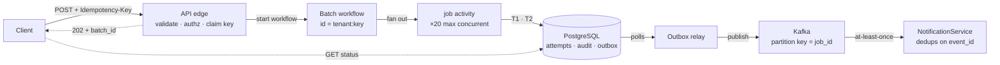
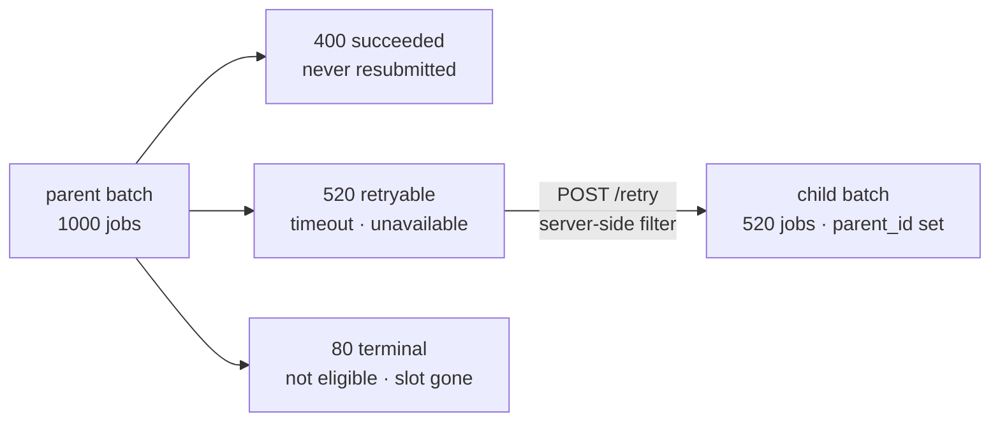

# ReschedulingEngine V2 — High-Level Design

**Status:** Proposed · **Date:** 2026-09-21 · **Author:** Aurora EM
**Replaces:** the V2 Design Proposal draft — same goals, different architecture

> **Provenance.** This is an artifact of the DMG Engineering Manager exercise. The
> service, tickets and metrics belong to that exercise's scenario; the design is
> mine. It is written as the counter-proposal I would hand back to the draft's
> author rather than as a review of it.

**Core claim:** idempotency is a property of a *boundary*, not of a system. This
flow has three boundaries and the draft names none of them.

---

## 1. Goals, and one goal that needs splitting

| Goal | As drafted | Restated |
|---|---|---|
| Batch rescheduling | Accept up to 1000 jobs | Unchanged — but as a *job*, not a request (§3) |
| Latency | "p99 from ~800ms to <500ms" | **Three numbers, not one** (§9) |
| Finish SchedulerV2 migration | Stated, no plan | A prerequisite, not a deliverable (§12, Phase 0) |

> ⚠️ **The draft's baseline is wrong.** It targets <500ms from "~800ms".
> Production p99 is **920ms** and has been missing its 800ms target. We commit to
> no latency number until the eligibility DSL is profiled — it alerted **156 times
> in 30 days** and appears nowhere in the draft.

---

## 2. What breaks today

| Failure | Mechanism | Closed by |
|---|---|---|
| Client retry doubles the work | 1000 × ~900ms serial ≈ 15 min in one request → gateway timeout → retry → every succeeded job reschedules again | §3, §4·B1 |
| Unrecoverable partial state | Exception at job 437: 1–436 done and published, 437–1000 untouched, no record of where it stopped, client gets a 500 | §3, §6 |
| Duplicate `job.rescheduled`<br>*(AURORA-1247, Sev-3)* | RPC and publish are separate steps with nothing transactional between them | §4·B3, §6 |
| Silent inconsistency | RPC succeeds, publish fails: job rescheduled, nobody notified, a provider goes to the wrong place | §6 |

> 💡 **One hypothesis worth ten minutes before anything is designed.** ~15% of
> traffic still routes through OldSchedulerV1 via the abandoned legacy adapter. If
> both paths publish for the same job, the abandoned migration *is* AURORA-1247 —
> which reorders this entire plan. That is one query against the event log,
> grouped by source path.

---

## 3. Shape: a batch is a job, not a request

`POST` validates, claims an idempotency key, starts a durable workflow and returns
`202` with a `batch_id`. Work happens on workers. The client polls for status.



Nothing publishes to Kafka directly. Every event leaves through the outbox.

### Endpoints

| Endpoint | Behaviour |
|---|---|
| `POST /reschedule/batch` | Validate → authorize → claim key → start workflow → `202 {batch_id}`. Never blocks on scheduling work. |
| `GET /reschedule/batch/{id}` | Counts plus per-job outcomes. Terminal once every job is `succeeded` or `failed`. |
| `POST /reschedule/batch/{id}/retry` | Child batch from the parent's retryable failures only (§7). |
| `POST /reschedule` | Unchanged contract — single job, synchronous. **Shares the same core.** |

> **One implementation of the business rules, two execution modes.** Eligibility,
> the claim, the scheduler call and the outbox write live in one function.
> Single-job calls it inline; batch calls it from an activity. This is what the
> first PR got wrong — it built a second, divergent path that skipped the
> eligibility check entirely.

---

## 4. Idempotency: three boundaries

The draft records idempotency as "handled by the scheduler" — an open question
written down as settled fact, with an open Sev-3 attached to it. It is not one
problem. It is three, and each needs its own key and its own dedup store.

```
  request ─────●────────── per job ──────────●────────── outcome ─────────●──── consumer
               │                             │                           │
         B1 · HTTP edge               B2 · scheduler call          B3 · event bus
               │                             │                           │
    client replays batch        same job executes twice      event delivered twice
               │                             │                           │
        Idempotency-Key                  dedup_key             event_id = dedup_key
        (client-supplied)             (derived, stable)           (deterministic)
               │                             │                           │
     UNIQUE(tenant, key)      UNIQUE(tenant, job, key)        consumer-side dedup
```

### B1 · HTTP edge — client replays the whole batch

The request is long enough to hit a gateway timeout, the client retries, and
**every already-succeeded job reschedules again.**

**Mechanism.** A required `Idempotency-Key` header. Store
`(tenant_id, key) → batch_id` under a unique constraint *before any work happens*:
`INSERT … ON CONFLICT DO NOTHING`, then read back. If your insert won, you own the
batch. If it conflicted, return the existing `batch_id` and its current status.
24-hour retention.

**Why client-supplied, not derived.** A derived key cannot tell a *retry* apart
from a customer legitimately rescheduling the same job to the same slot twice.
Only the client knows which it is. Derived keys are the fallback for clients that
send none.

**Temporal gives this for free.** Set the workflow ID to `tenant:key` with a
reject-duplicate reuse policy and the platform refuses the second start. One less
store to hand-roll.

### B2 · Scheduler call — the same job executes twice

Three live routes: the same `job_id` twice in one payload (**the draft doesn't
reject this**), the same job in two concurrent batches, or a worker retrying an
activity.

**Mechanism.** A `reschedule_attempts` row, unique on
`(tenant_id, job_id, dedup_key)`, inserted *before* the scheduler call. On
conflict, skip and return the recorded outcome. `dedup_key` is derived and stable —
`hash(tenant_id, job_id, requested_at, batch_idempotency_key)` — never a fresh
UUID, because the whole point is that a retry produces the same value.

**The decision that matters.** We do *not* depend on SchedulerV2 being idempotent.
Nobody has verified it. We make our own layer idempotent so that it does not
matter what the scheduler does — and we pass `dedup_key` to the scheduler anyway,
so that if it *is* idempotent we get defence in depth for free. If it turns out to
be idempotent we have spent one insert per job. If it is not, we have avoided the
incident.

### B3 · Event bus — the event is delivered twice (AURORA-1247)

Today the RPC and the publish are separate steps with nothing transactional
between them. Retry the RPC and you publish twice; **fail the publish and the job
moves with nobody notified.**

**Mechanism, part one — transactional outbox.** The event row is written in the
*same* transaction as the state change (§6). Nothing publishes to Kafka directly;
a relay drains the outbox.

**Mechanism, part two — deterministic `event_id`**, equal to `dedup_key`, so
NotificationService dedups on it.

**You need both, and here is the honest limit.** Exactly-once end-to-end does not
exist. Kafka is at-least-once, and the relay can itself crash between publishing
and marking a row sent. So the outbox removes *spurious* duplicates (the business
action happened once — do not announce it twice) and the consumer-side `event_id`
absorbs redelivery. What ships is **effectively-once: at-least-once delivery plus
idempotent consumption.**

---

## 5. Data model

Four tables, all PostgreSQL, all additive. The unique constraints *are* the
idempotency mechanism — the design expressed in DDL.

```sql
-- B1: one batch per idempotency key, per tenant
reschedule_batches
  batch_id          uuid primary key
  tenant_id         uuid        not null
  idempotency_key   text        not null
  state             text        -- accepted | running | succeeded | partial | failed
  total, succeeded, failed  int
  retry_count       int         default 0
  parent_batch_id   uuid null   -- set on retry children
  created_at, updated_at    timestamptz
  unique (tenant_id, idempotency_key)

-- B2: one execution per job per key. The claim row.
reschedule_attempts
  attempt_id        uuid primary key
  batch_id          uuid null       -- null for single-job calls
  tenant_id         uuid        not null
  job_id            text        not null
  dedup_key         text        not null
  state             text        -- pending | succeeded | failed | ineligible
  scheduler_ref     text null       -- new_schedule_id, once known
  error_code        text null
  retryable         boolean null
  claimed_at, updated_at    timestamptz
  unique (tenant_id, job_id, dedup_key)

-- B3: events leave here, never from application code
outbox
  event_id          text primary key   -- = dedup_key. Dedup is structural.
  topic             text
  partition_key     text        -- job_id, so a job's events stay ordered
  payload           jsonb
  created_at        timestamptz
  published_at      timestamptz null
  index (created_at) where published_at is null

-- unchanged, and staying in PostgreSQL (§11)
reschedule_events   -- the audit log
```

---

## 6. Per-job sequence: two transactions, one network call between them

The rules it obeys: **never hold a transaction open across a network call**, and
**never let the outcome and its announcement be written separately.**

```
TODAY
  ┌──────────────────┐         ┌───────────────┐
  │ SchedulerV2 RPC  │ ──────> │ Kafka publish │
  └──────────────────┘         └───────────────┘
          └───── no transaction between them ─────┘

    RPC retried       → published twice
    publish fails     → job moved, nobody told
    crash between     → no record either way


PROPOSED
  ┌──────────────────┐   ┌──────────────────┐   ┌────────────────────────┐
  │ T1 · claim       │──>│ (no transaction) │──>│ T2 · commit, atomic    │──> relay
  │ insert attempt   │   │ eligibility      │   │ attempt → succeeded    │    drains
  │ on conflict →    │   │ SchedulerV2 RPC  │   │ + audit row            │    → Kafka
  │ return outcome   │   │ timeout+dedup_key│   │ + outbox event         │
  └──────────────────┘   └──────────────────┘   └────────────────────────┘

  The activity body is idempotent, so Temporal's at-least-once execution is safe.
  Replay re-enters T1, hits the conflict, and returns the recorded outcome
  instead of rescheduling again.
```

Because the outcome and the event it announces commit together, both
"rescheduled but not announced" and "announced but not rescheduled" become
unreachable.

### The hard case, stated rather than hidden

If the process dies after the RPC succeeds but before T2 commits, the attempt row
is left `pending` — and `pending` means either *in flight* or *crashed*, which you
cannot distinguish from the row alone.

- **Primary resolution.** The activity carries `dedup_key` into the scheduler
  call, so re-executing is safe. Temporal retries the activity, T1 conflicts, the
  RPC is re-issued under the same key, T2 commits. It converges.
- **If SchedulerV2 turns out not to be idempotent.** A reconciliation job sweeps
  attempts `pending` for more than five minutes, queries the scheduler for the
  job's actual current schedule, and resolves the row against ground truth. This
  escape hatch is what makes the design honest rather than optimistic.
- **Either way it is observable.** `attempts_pending_over_5m` is an alerting
  metric, not a silent condition.

---

## 7. Partial failure: the status contract and reprocessing

### The status resource always returns 200

The `GET` succeeded; the batch's outcome is in the body, never in the HTTP status.
No `207` — that is for multi-request semantics, not for reporting on async work.
`404` for an unknown `batch_id`, `403` if it is not yours.

```jsonc
GET /reschedule/batch/b_7f3a91  →  200 OK
{
  "batch_id": "b_7f3a91",
  "state": "partial",                // accepted|running|succeeded|partial|failed
  "counts": {
    "total": 1000, "succeeded": 400, "failed": 600,
    "retryable": 520, "terminal": 80, "pending": 0
  },
  "retry": {
    "retry_url": "/reschedule/batch/b_7f3a91/retry",
    "retryable_job_ids": ["J-1002", "J-1007", "…"],
    "retry_count": 0, "max_retries": 3
  },
  "results": [
    { "job_id": "J-1001", "state": "succeeded", "new_schedule_id": "s_88" },
    { "job_id": "J-1002", "state": "failed", "retryable": true,
      "error_code": "SCHEDULER_TIMEOUT", "attempts": 3 },
    { "job_id": "J-1003", "state": "failed", "retryable": false,
      "error_code": "JOB_NOT_ELIGIBLE",
      "error_message": "Job is already in COMPLETED state" }
  ]
}
```

While the batch is `running`, `counts.pending` is non-zero and `results` carries
only jobs that have reached a terminal state. Beyond 1000 results the collection
paginates, and `?state=failed&retryable=true` filters it.

> **Why `failed` and `partial` are different states.** All 1000 failing almost
> always means the scheduler is down, not that a thousand business rules fired.
> The client should back off, not retry job by job. Collapsing both into
> "completed with errors" throws that signal away.

### 600 failures are not one thing — this is the whole answer

Retrying a business rejection fails identically forever and spends the tenant's
quota doing it. So every failure carries `retryable`, and the counts split the
total.

| `retryable: true` — transient | `retryable: false` — terminal |
|---|---|
| `SCHEDULER_TIMEOUT` | `JOB_NOT_ELIGIBLE` — already completed or cancelled |
| `SCHEDULER_UNAVAILABLE` | `JOB_NOT_FOUND` |
| `SCHEDULER_RATE_LIMITED` | `SLOT_UNAVAILABLE` — that time is gone |
| `INTERNAL_ERROR` | `REQUESTED_AT_IN_PAST` |
| `NO_PROVIDER_CAPACITY` + `retry_after_seconds` | `TENANT_MISMATCH` — caught at the edge |

In the 400/600 case: **520 are worth retrying and 80 need a human or a different
request.** The client retries 520, not 600.

### Reprocessing



```
POST /reschedule/batch/b_7f3a91/retry  →  202 Accepted
{ "batch_id": "b_9c22e4", "parent_batch_id": "b_7f3a91", "total": 520 }
```

- **Server-side filtering.** The child batch is built from the parent's retryable
  failures, so the client cannot get the subset wrong and retry logic is not
  reimplemented in every caller.
- **No `Idempotency-Key` required.** The child's key is derived:
  `hash(parent_batch_id, "retry", retry_count)`. Calling `/retry` twice returns
  the same child batch.
- **Capped.** `max_retries: 3`, tracked on the lineage. `retry_count` is a metric
  worth watching — batches that routinely need three retries mean the scheduler is
  unhealthy, not that clients are unlucky.
- **Quota applies.** A retry is a batch. It queues behind the tenant's
  concurrency cap like any other.

> ⚠️ **Correction to an earlier draft of this section.** An earlier version
> claimed a client could safely re-submit the whole original batch because B2
> would absorb the successes. **That is false**, and the reason matters:
> `dedup_key` includes the batch idempotency key, so a new batch produces new
> dedup keys and *all 1000 would execute again* — 400 pointless RPCs and 400
> spurious `job.rescheduled` events on a service with an open double-fire
> incident.
>
> The boundaries answer different questions. **B1** answers "did my request
> land?" — same key, same batch returned. **B2** answers "did this activity run
> twice inside one logical request?" — scoped to that request. **A retry is a new
> logical request**, so it gets a new key and must carry only the jobs you want
> executed. The `/retry` endpoint exists to make that the default rather than
> something every client has to know.

### Edge-case responses

| Case | Response |
|---|---|
| Accepted | `202` + `batch_id`. Always. Acceptance is not a claim about outcomes. |
| Replayed key | `202` + the *same* `batch_id`, plus `Idempotency-Replayed: true`. Never new work. |
| Same key, different payload | `409`. The key is a promise about the request; a different body under it is a client bug worth surfacing loudly. |
| Validation failure | `400`, naming the offending `job_id`s — duplicates in the payload, over the size cap, malformed. |
| Not your job | `403`. Every `job_id` checked against the caller's tenant. **Currently absent entirely.** |
| `/retry` with nothing retryable | `409` with `counts`, rather than an empty batch nobody asked for. |
| `/retry` past `max_retries` | `429` + `Retry-After`, and an alert — three failed retries is a service problem, not a client one. |

---

## 8. Concurrency, isolation and fairness

- **Bounded fan-out.** 20 activities in flight per batch, not 1000. SchedulerV2
  rate-limits per caller; unbounded parallelism spends the gain on retries.
- **Separate task queues for batch and single-job.** The fix for the blast radius
  in §2 — batch work can no longer exhaust the workers single-job rescheduling
  depends on. In the current design one batch request can take down
  `POST /reschedule`.
- **Per-tenant concurrency cap.** One customer submitting back-to-back 1000-job
  batches cannot starve everyone else.
- **Notification burst control.** 1000 reschedules imply up to 2000
  notifications. The relay publishes at a bounded rate, and we emit one
  `batch.rescheduled` summary event alongside the per-job stream so
  NotificationService *can* collapse them. Whether it will is their decision,
  not ours (§14).

---

## 9. Latency, as three numbers with a budget

"p99 under 500ms" cannot be designed against until you say *which* p99.

| Measurement | Target | Composition |
|---|---|---|
| Accept latency (`POST → 202`) | p99 < 200ms | Validate + authz + two writes + workflow start. No scheduling work. |
| Single-job end-to-end | p99 < 500ms | The draft's real goal. Budget below. |
| Batch completion (1000 jobs) | p95 < 30s | A throughput target. 1000 ÷ 20 × ~350ms ≈ 18s nominal. |

### Single-job budget, per hop

| Hop | Budget | Note |
|---|---|---|
| Eligibility check (DSL) | 150ms | **Unvalidated.** The hot spot — 156 alerts in 30 days. Profile first. |
| SchedulerV2 RPC | 200ms | With an explicit timeout. Currently there is none. |
| T1 + T2 | 50ms | Four indexed writes, same connection. |
| Serialisation + network | 100ms | |
| **Total** | **500ms** | |

> ⚠️ **This budget is a hypothesis, not a commitment.** The eligibility line is a
> guess and it is the largest item. First task in Phase 2 is instrumenting it
> per-hop. If eligibility turns out to be 400ms, 500ms is unreachable without
> changing the DSL — a different project, which the draft silently assumed away.

---

## 10. Observability

The service is currently missing both SLOs and nobody noticed — the draft cites a
latency figure 120ms out of date. Instrumentation is part of this design, not a
follow-up ticket.

| Signal | Why it exists |
|---|---|
| `dedup_hit_rate` (B1, B2) | **The most informative metric here.** Non-zero means real retries are being absorbed. Flat zero means the mechanism is unwired or clients aren't sending keys. |
| `attempts_pending_over_5m` | The §6 hard case made visible. Should be zero; alerting if not. |
| `outbox_depth`, `outbox_lag_seconds` | Relay health. Growing depth means events written but not announced. |
| `accept_latency`, `job_duration`, `batch_completion` | The three numbers in §9, measured separately because they are different promises. |
| `retry_count` distribution | Batches routinely needing three retries means the scheduler is unhealthy. |
| Per-hop spans on the single-job path | So the §9 budget is verifiable rather than asserted. |
| SLO burn-rate alerts | Not point-in-time thresholds. The existing EligibilityDSL alert fired 156 times "just over threshold" and taught the team to ignore it. |

---

## 11. Storage decisions

### The audit log stays on PostgreSQL

| Reason given in the draft | Response |
|---|---|
| "Document model fits event data better" | The shape is fixed and access is by key. A document store buys nothing a table doesn't. |
| "Sharding gives horizontal scale" | No write rate, row count or growth figure appears anywhere. Nothing establishes Postgres as the constraint. |
| "Atlas reduces ops burden" | We already run Postgres. This *adds* a datastore, new backup and restore procedures, new runbooks, new on-call surface, a new cost line. |

Two arguments the draft does not address:

- **This design needs transactions across those tables.** The attempt row, the
  audit row and the outbox event commit together (§6). Split the audit log into
  another store and you reintroduce the dual write this design exists to remove.
- **A feature flag cannot roll back a data migration.** The draft's rollback story
  *is* the flag. Turn it off mid-migration and the data is split across two stores
  with no path back. Every table in §5 is additive precisely so the flag works.

> **What would change my mind:** write volume, row count and growth rate; an
> inventory of who reads `reschedule_events` today (support tooling, dispute
> resolution, the Snowflake pipelines); and a migration plan with backfill,
> dual-write, verification, cutover and rollback. Bring those and it is a yes — as
> its own piece of work, not riding along with a delivery commitment.

### Redis: yes for two things, no for the claim

The obvious suggestion is to hold idempotency keys in Redis rather than a Postgres
constraint. It is the wrong place for the claim, and the reason is structural
rather than the usual one about durability.

> ⚠️ **The Postgres claim is not a lock — it is in the same transaction as the
> outcome.** T2 (§6) writes the attempt state, the audit row and the outbox event
> atomically. Put the claim in Redis and the outcome in Postgres and you have a
> **dual write between the claim and the result** — precisely the bug class the
> outbox exists to remove at B3. You would eliminate it at the event boundary and
> reintroduce it at the claim boundary.

The durability objections are real as well, and each produces a rare, silent,
unreproducible duplicate — the worst failure shape there is, on a service that
already has one unexplained double-fire:

| Property | How it fails |
|---|---|
| Asynchronous persistence | AOF `everysec` loses up to a second of writes; RDB loses more. A crash loses the claim. |
| Asynchronous replication | `SET NX` returns OK, the primary dies before replicating, the replica is promoted without the key — a retry wins the claim again and the job executes twice. |
| Eviction | Under `maxmemory-policy allkeys-lru` idempotency keys are evictable. A common misconfiguration that silently destroys correctness. |

**And the same test applied to MongoDB above applies here:** the claim is one
indexed insert per request, and Postgres does tens of thousands of those per
second. There is no performance problem to solve. In fairness, Redis is already in
the stack, so a new *use* of it costs far less than a new datastore would — that
weakens the operational argument, but not the dual-write one.

Where it does belong:

- **Caching the status read.** A client with a 1000-job batch polls `GET status`
  every second for thirty seconds — polling amplification against Postgres for
  data that changes incrementally. Cache with a 1–2s TTL or write through on state
  change. One second of staleness is harmless. **Worth building.**
- **Fast-path short-circuit for replayed keys**, under one strict rule: Redis may
  only ever *short-circuit a known duplicate*, never *grant* a claim. Read
  `idem:{tenant}:{key}`; a hit returns the existing `batch_id` with no database
  round trip, a miss falls through to the authoritative Postgres claim, and the
  key is written *only after that commit*. A miss costs a query, not correctness.
  Keep the Redis TTL shorter than the Postgres retention window or you will hand
  back a `batch_id` for a purged batch.
- **Per-tenant quota counters** (§8). The right tool. Approximate counting is
  acceptable — losing a counter costs a slightly-too-permissive window, not a
  duplicate reschedule.
- **Not the outbox.** That has to be transactional with the business write.

> **The principle, stated once so it generalises:** Redis is excellent where
> losing the data costs *performance*. It is wrong where losing the data costs
> *correctness*. Idempotency claims are correctness. Status reads and quota
> counters are performance.

---

## 12. Rollout

| Phase | Work | Exit criteria |
|---|---|---|
| **0 · De-risk**<br>1 sprint | Idempotency (B2) and the outbox (B3) on the *existing single-job path*. Close AURORA-1247. Legacy adapter to 0%. Restore deploy frequency — cause of the decline to be established first, since the fix differs by cause. | Zero duplicate events for 7 days · legacy traffic at 0% · deploys ≥ 4/week |
| **1 · Batch**<br>1–2 sprints | Async endpoint, workflow, status endpoint, quotas, authz. One tenant, behind a *customer-scoped* flag. | 1000-job batch p95 < 30s · `dedup_hit_rate` wired · zero stuck attempts |
| **2 · Widen** | Tenant by tenant. Not by percentage — a new endpoint has no existing traffic for a percentage to mean anything. | Success rate ≥ 99.5% at each step before the next |
| **3 · Latency** | Profile the eligibility DSL. Set the per-hop budget against measurements. Then optimise. | Single-job p99 < 500ms, or a written explanation of why not |

> **Phase 0 is not negotiable and it is not batch work.** Nothing ships onto a
> Zero Touch path with an open duplicate-events incident and zero deploys a week.
> The draft's three-week staged rollout assumes a deploy capability this team does
> not currently have.

---

## 13. What this design does not do

- **It does not achieve exactly-once.** That does not exist across a network
  boundary. It achieves effectively-once, and §4·B3 says so.
- **It does not make batch fast.** A 1000-job batch takes tens of seconds. It
  makes batch *durable, resumable and safe to retry*, which is the property the
  business requirement actually needs.
- **It does not fix the eligibility DSL.** It budgets for it and instruments it.
  Changing it is a separate project with its own risk.
- **It does not migrate any data.** Deliberately — that is what makes the flag a
  real rollback.
- **It adds a component.** The outbox relay is a new thing to run, monitor and
  page on. That cost is real, and I accept it because the alternative is a dual
  write on a customer-facing path.

---

## 14. Open questions

The section the draft left blank. A design with no open questions has not been
stress-tested; these are the six I want answered before Phase 1.

| Question | Who | Blocks |
|---|---|---|
| Does the double-fire correlate with the 15% on OldSchedulerV1? One query, grouped by source path. | Priya | Phase 0 sequencing |
| Is SchedulerV2 idempotent, and under what key? If yes, B2 is defence in depth. If no, the §6 reconciliation sweep is load-bearing. | Scheduler team | §6 detail |
| Can NotificationService collapse a burst, or do we rate-limit the relay? 2000 notifications in seconds is their problem before it is ours. | Notifications owner | Phase 1 exit |
| Who reads `reschedule_events` today, and what would a schema change break? | Raj + data | §11 decision |
| Where does 1000 come from? A customer need, or a round number? The cap is cheap to raise and expensive to lower. | Product | §7 validation |
| Will clients actually send an `Idempotency-Key`? If the main caller will not, B1 degrades to a derived key and we lose the retry-versus-repeat distinction. | Raj + client owners | §4·B1 |
